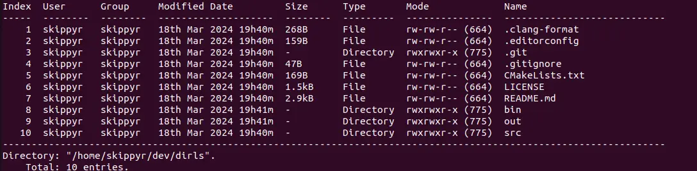

<p align="center">
    
</p>
<h1 align="center">≥v≥v&ensp;dirls&ensp;≥v≥v</h1>
<p align="center">Directory Lister</p>
<p align="center">
    
    &nbsp;
    
    &nbsp;
    
    &nbsp;
    
</p>

## ❡ About

A terminal utility that list the entries inside of directories on Windows and Linux.

<p align="center">
    
</p>
<p align="center"><sup><strong>Caption:</strong> a preview of <code>dirls</code> running on Linux.</p>

## ❡ Install

### Dependencies

The following dependencies must be installed before installing it:

#### Dependencies For Windows

- **Visual Studio 2022**: it provides all the tools required to build this library.
- **git**: it will be used to clone this repository.

#### Dependencies For Linux

- **gcc**, **cmake**, **ninja**: they will be used to build this library.
- **git**: it will be used to clone this repository.

### Procedures

On Windows, using either `Developer Command Prompt For VS 2022` or `Developer PowerShell For VS 2022`, or, on Linux, using any terminal, follow these steps:

- Clone this repository using `git`:

```sh
git clone --depth 1 https://github.com/skippyr/dirls
```

- Access the repository directory using `cd`:

```sh
cd dirls
```

- Use `cmake` and `ninja` to build it:

```sh
cmake -B out -G Ninja
cmake --build out
cmake --install out
```

- Add the directory `bin` created, that is now on your current directory, to your system `PATH` environment variable.
- Reopen your shell session.

## ❡ Documentation

After installed, you can learn how to use it by reading its help page:

```sh
dirls --help
```

## ❡ Help

If you need help related to this project, open a new issue in its [issues pages](https://github.com/skippyr/dirls/issues) or send me an [e-mail](mailto:skippyr.developer@gmail.com) describing what is going on.

## ❡ Contributing

This project is open to review and possibly accept contributions, specially fixes and suggestions. If you are interested, send your contribution to its [pull requests page](https://github.com/skippyr/dirls/pulls) or to my [e-mail](mailto:skippyr.developer@gmail.com).

By contributing to this project, you agree to license your work under the same license that the project uses.

## ❡ License

This project is licensed under the BSD-3-Clause License. Refer to the `LICENSE` file that comes in its source code for license and copyright details.

&ensp;
<p align="center"><sup><strong>≥v≥v&ensp;Here Be Dragons!&ensp;≥v≥</strong><br />Made with love by skippyr <3</sup></p>
